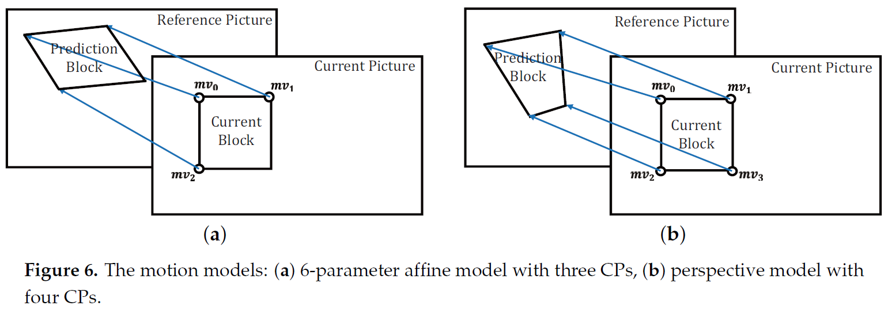
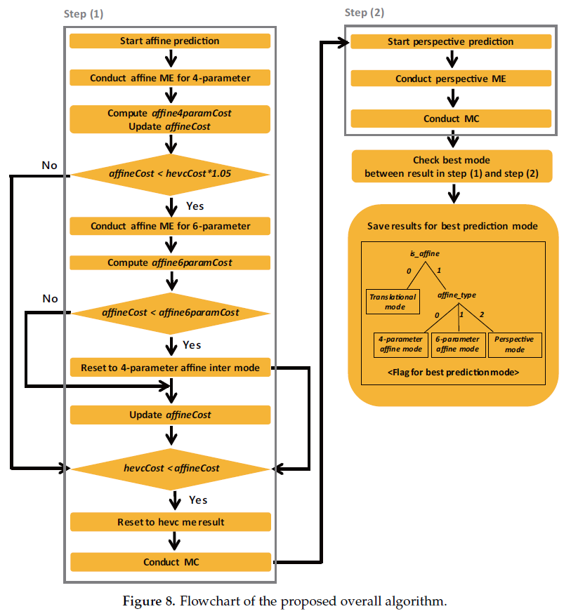
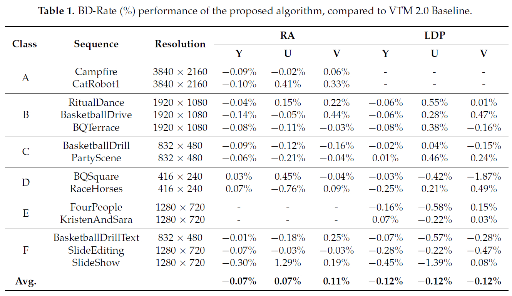

# Design of Efficient Perspective Affine Motion Estimation/Compensation for Versatile Video Coding (VVC) Standard
#### Young-Ju Choi, Dong-San Jun, Won-Sik Cheong, and Byung-Gyu Kim
#### Intelligent Vision Processing Lab. (IVPL), Sookmyung Women's University, Seoul, Republic of Korea
----------------------------
#### This repository is the official implementation of the paper published in _Electronics (2019)_.
[](https://www.mdpi.com/2079-9292/8/9/993/htm)

----------------------------
## Summary of paper
#### Abstract
> _The fundamental motion model of the conventional block-based motion compensation in High Efficiency Video Coding (HEVC) is a translational motion model. However, in the real world, the motion of an object exists in the form of combining many kinds of motions. In Versatile Video Coding (VVC), a block-based 4-parameter and 6-parameter affine motion compensation (AMC) is being applied. In natural videos, in the majority of cases, a rigid object moves without any regularity rather than maintains the shape or transform with a certain rate. For this reason, the AMC still has a limit to compute complex motions. Therefore, more flexible motion model is desired for new video coding tool. In this paper, we design a perspective affine motion compensation (PAMC) method which can cope with more complex motions such as shear and shape distortion. The proposed PAMC utilizes perspective and affine motion model. The perspective motion model-based method uses four control point motion vectors (CPMVs) to give degree of freedom to all four corner vertices. Besides, the proposed algorithm is integrated into the AMC structure so that the existing affine mode and the proposed perspective mode can be executed adaptively. Because the block with the perspective motion model is a rectangle without specific feature, the proposed PAMC shows effective encoding performance for the test sequence containing irregular object distortions or dynamic rapid motions in particular. Our proposed algorithm is implemented on VTM 2.0. The experimental results show that the BD-rate reduction of the proposed technique can be achieved up to 0.45% and 0.30% on Y component for random access (RA) and low delay P (LDP) configurations, respectively._
>

#### Perspective Motion Model for Motion Estimation
<p align="center">
  
</p>

#### Perspective Affine Motion Compensation (PAMC)
<p align="center">
  
</p>

#### Experimental Results
<p align="center">
  
</p>

----------------------------
## Getting Started
#### How to build?
To evaluate the performance of the proposed PAMC module, the proposed algorithm was implemented on [Versatile Video Coding (VVC) Test Model 2.0 (VTM 2.0)](https://vcgit.hhi.fraunhofer.de/jvet/VVCSoftware_VTM/-/tree/VTM-2.0).

The VTM software uses [cmake](http://www.cmake.org/) to create the needed build files.

1. Create a build directory in the root directory

    ```bash
      mkdir build
    ```

2. Run following cmake commands

    - Windows
    - Linux Release
    - Linux Debug
    - MACOSX Xcode

----------------------------

    
----------------------------
## Citation
    @article{choi2019design,
      title={Design of efficient perspective affine motion estimation/compensation for versatile video coding (VVC) standard},
      author={Choi, Young-Ju and Jun, Dong-San and Cheong, Won-Sik and Kim, Byung-Gyu},
      journal={Electronics},
      volume={8},
      number={9},
      pages={993},
      year={2019},
      publisher={MDPI}
    }
